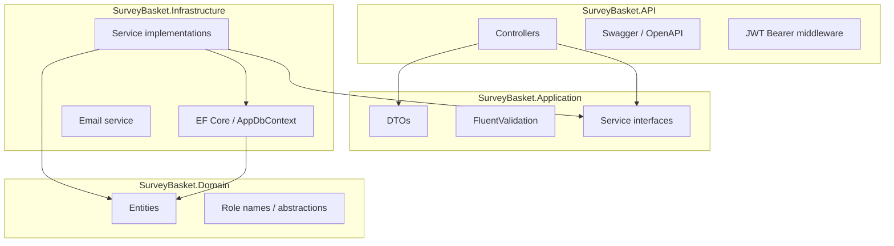
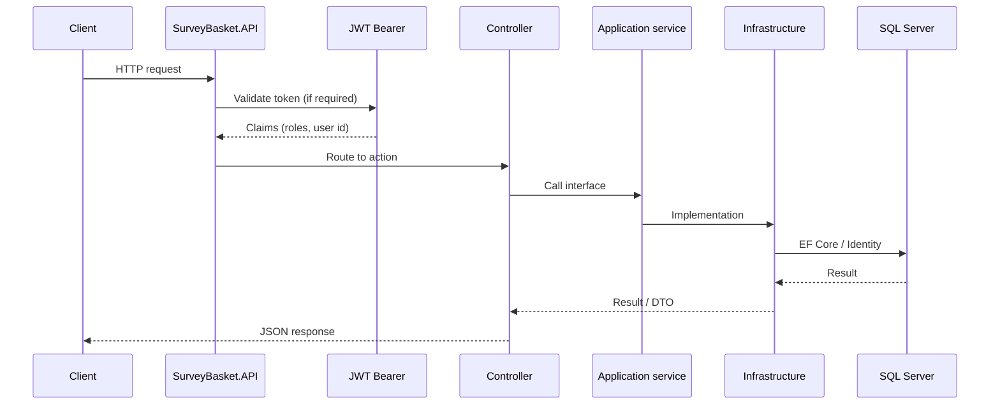
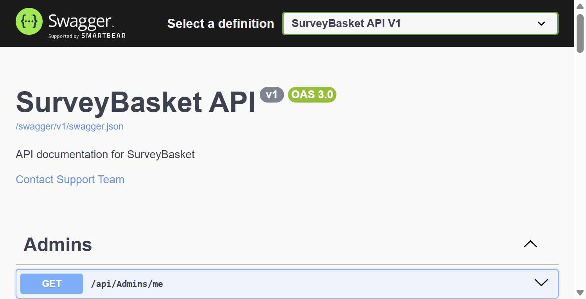
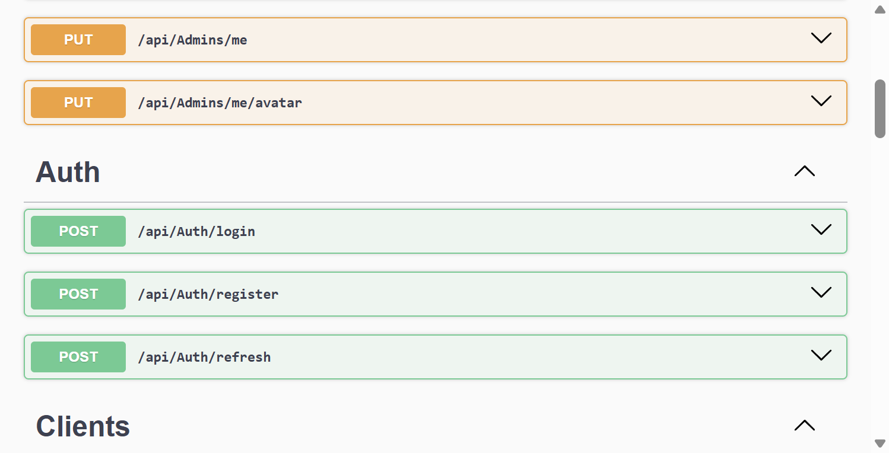
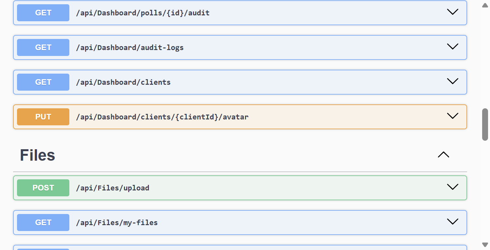
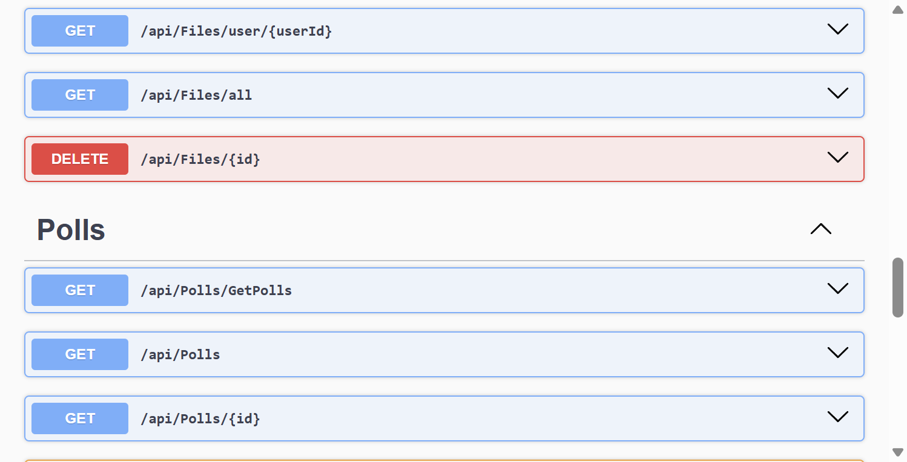
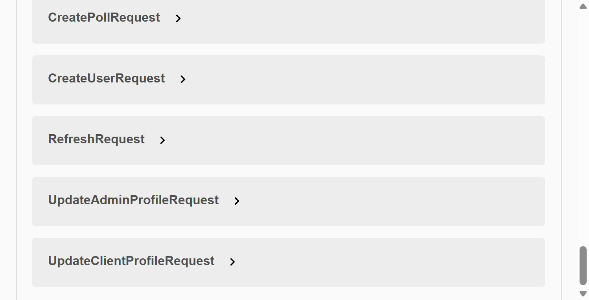

# SurveyBasket

> **Stack:** .NET 8 · SQL Server · Identity · JWT · Swagger (dev)

Backend API for managing surveys (“polls”), user profiles, file attachments, and an admin dashboard with audit visibility. The solution follows a **layered / clean architecture** with **ASP.NET Core 8**, **Entity Framework Core**, **ASP.NET Core Identity**, and **JWT** authentication.

---

## 📋 Overview

| Area | Description |
|------|-------------|
| **Authentication** | Register (multipart), login (JSON), refresh tokens |
| **Roles** | `Admin` and `User` (clients); policies enforced per controller |
| **Polls** | CRUD, publish toggle, public list of polls, attachments |
| **Files** | Upload, list mine / by user / all, admin delete |
| **Dashboard** | Admin: summary, audit logs, client list, create users, poll details |
| **Profiles** | Admin and client profile + avatar endpoints |

---

## 🏗️ Architecture

High-level layering (dependencies point **inward**; Domain has no infra references):



### Request pipeline (simplified)



### Role-based access (conceptual)

```mermaid
flowchart LR
    subgraph Public["Anonymous"]
        A1[GET /api/Polls, /GetPolls]
        A2[POST /api/Auth/*]
    end
    subgraph UserRole["JWT: User"]
        U1[/api/Clients/me*]
        U2[/api/Files/* except admin-only]
        U3[/api/Polls/* authenticated ops]
    end
    subgraph AdminRole["JWT: Admin"]
        D1[/api/Dashboard/*]
        AD1[/api/Admins/me*]
        F1[DELETE /api/Files/{id}]
    end
```

---

## 📁 Solution structure

| Project | Responsibility |
|---------|----------------|
| **SurveyBasket.API** | HTTP API, Swagger, auth configuration, static files (`wwwroot`) |
| **SurveyBasket.Application** | DTOs, validators, service contracts |
| **SurveyBasket.Infrastructure** | EF Core, Identity, email, concrete services |
| **SurveyBasket.Domain** | Entities and shared abstractions |

> **Note:** The repository may also contain a legacy **`SurveyBasket`** web project. The primary documented host for this README is **`SurveyBasket.API`**.

---

## 🧰 Tech stack

- **.NET 8** — ASP.NET Core Web API  
- **SQL Server** — EF Core provider  
- **ASP.NET Core Identity** — users and roles  
- **JWT Bearer** — access / refresh flow  
- **FluentValidation** — request validation  
- **Mapster** — object mapping  
- **Swashbuckle** — Swagger UI (Development)  

---

## ✅ Prerequisites

- [.NET 8 SDK](https://dotnet.microsoft.com/download)  
- SQL Server (local or remote); connection string in configuration  
- (Optional) SMTP-capable mail host for welcome / transactional email  

---

## ⚙️ Configuration

Configure in `SurveyBasket.API/appsettings.json` or **User Secrets** / environment variables for production:

- `ConnectionStrings:DefaultConnection` — SQL Server  
- `Jwt:*` — signing key, issuer, audience, token lifetime  
- `DefaultAdmin:*` — first-run admin seed (see `DataSeeder`)  
- `AllowAOrigin` — CORS origins (e.g. Angular on `localhost:4200`)  
- `EmailSettings:*` — SMTP for outbound email  

Never commit real production secrets; use secret managers or vaults in deployed environments.

---

## ▶️ Run locally

```bash
cd SurveyBasket.API
dotnet run
```

Default HTTPS URL (from `launchSettings.json`): **https://localhost:7270**

- **Swagger UI** (Development only): root URL, e.g. `https://localhost:7270/` (see `Program.cs`: `RoutePrefix = string.Empty`).  
- **OpenAPI JSON**: `/swagger/v1/swagger.json`  
- **Static files** under `wwwroot` are served at the site root (e.g. `/docs/...` for files placed in `wwwroot/docs`).

---

## 📡 API reference (summary)

| Tag / area | Method & path | Auth |
|------------|---------------|------|
| **Auth** | `POST /api/Auth/login` | Anonymous |
| | `POST /api/Auth/register` | Anonymous (multipart) |
| | `POST /api/Auth/refresh` | Anonymous |
| **Admins** | `GET|PUT /api/Admins/me`, `PUT /api/Admins/me/avatar` | Admin |
| **Clients** | `GET|PUT /api/Clients/me`, `PUT /api/Clients/me/avatar` | Authenticated |
| **Dashboard** | `POST /api/Dashboard/create-user`, `GET /api/Dashboard/summary`, `GET /api/Dashboard/polls/{id}`, `GET /api/Dashboard/polls/{id}/audit`, `GET /api/Dashboard/audit-logs`, `GET /api/Dashboard/clients`, `PUT /api/Dashboard/clients/{clientId}/avatar` | Admin |
| **Files** | `POST /api/Files/upload`, `GET /api/Files/my-files`, `GET /api/Files/user/{userId}`, `GET /api/Files/all`, `DELETE /api/Files/{id}` | Authenticated; **delete** Admin |
| **Polls** | `GET /api/Polls`, `GET /api/Polls/GetPolls` | Anonymous |
| | `GET /api/Polls/{id}`, `POST /api/Polls/Addpool`, `PUT /api/Polls/{id}`, `DELETE /api/Polls/{id}`, `PUT /api/Polls/{id}/toggle-publish` | Authenticated (per controller rules) |

Exact status codes and bodies are defined in code and in Swagger.

---

## 🖼️ Swagger UI screenshots

Captured Swagger UI views are stored under **`SurveyBasket.API/wwwroot/docs/`** so they are served when the API is running (`/docs/<filename>`), and can also be viewed from the repository for documentation.

| # | File | What it shows |
|---|------|----------------|
| 1 | `01-swagger-overview-admins.png` | API title, OpenAPI 3.0, **Admins** section |
| 2 | `02-swagger-auth-and-clients-start.png` | **Auth** (login, register, refresh) and start of **Clients** |
| 3 | `03-swagger-dashboard-and-files.png` | **Dashboard** and **Files** operations |
| 4 | `04-swagger-files-and-polls.png` | **Files** (remaining) and **Polls** |
| 5 | `05-swagger-schemas.png` | **Schemas** (request/response models) |

### Gallery (repository paths)











---

## 👤 Roles

Defined in `DefaultRoles`: **`Admin`** and **`User`**.  
- **Clients** use the **`User`** role for normal account features.  
- **Dashboard** and dedicated **Admins** profile routes require **`Admin`**.

---

## 📄 License / contact

Project metadata in Swagger lists **Support Team** — adjust `Program.cs` `OpenApiInfo` and this README as needed for your deployment.
